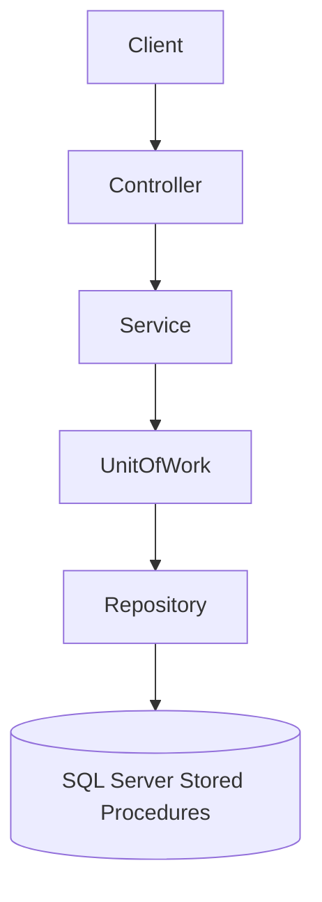

# Student Management API

Production-ready ASP.NET Core Web API (.NET 8) for managing students using clean layered architecture, ADO.NET, and SQL Server stored procedures.

## Project Structure

```
SampleWebAPI/
├── StudentManagementApi/           # ASP.NET Core Web API
│   ├── Controllers/
│   ├── Models/
│   ├── Services/
│   ├── Repositories/
│   ├── UnitOfWork/
│   ├── Data/
│   └── Middleware/
├── StudentManagement.Database/     # SQL scripts & deploy tooling
│   ├── Scripts/
│   └── deploy/
├── StudentManagementApi.Tests/     # xUnit + Moq
├── pipelines/                      # Azure DevOps YAML templates
├── azure-pipelines.yml             # Dev + QA pipeline
├── azure-pipelines-prod.yml        # Production pipeline
└── docs/CICD.md                    # Azure DevOps setup guide
```

## Prerequisites

- .NET 8 SDK
- SQL Server (LocalDB or full instance)

## Database Setup

Scripts are in the **`StudentManagement.Database`** project and deployed automatically by CI/CD.

### Local (manual)

```powershell
cd StudentManagement.Database
./deploy/Deploy-Database.ps1 `
  -Server "localhost" `
  -Database "StudentDb_Dev" `
  -UseTrustedConnection `
  -TrustServerCertificate
```

### Local connection string

Use **User Secrets** for development (never commit passwords):

```bash
dotnet user-secrets init --project StudentManagementApi
dotnet user-secrets set "ConnectionStrings:DefaultConnection" "Server=...;Database=StudentDb_Dev;..." --project StudentManagementApi
```

Or override in `appsettings.Development.json` for local SQL Server only.

## CI/CD (Azure DevOps)

Push to **`dev`** → build, test, publish artifacts, deploy database + API to **Dev** and **QA**.

Push to **`main`** → build, test, deploy to **Production** (with optional approval on the `prod` environment).

See **[docs/CICD.md](docs/CICD.md)** for Azure DevOps environments, variable groups, and service connection setup.

## Run the API

```bash
dotnet run --project StudentManagementApi
```

Swagger UI (Development): `https://localhost:<port>/swagger`

## API Endpoints

| Method | Endpoint | Description |
|--------|----------|-------------|
| GET | `/api/student` | Get all students |
| GET | `/api/student/{id}` | Get student by ID |
| POST | `/api/student` | Create a student |
| PUT | `/api/student/{id}` | Update a student |
| DELETE | `/api/student/{id}` | Delete a student |

## Sample Requests and Responses

### GET /api/student

**Response `200 OK`**

```json
[
  {
    "id": 1,
    "firstName": "John",
    "lastName": "Doe",
    "email": "john.doe@example.com",
    "age": 21,
    "createdDate": "2026-06-14T10:30:00Z"
  },
  {
    "id": 2,
    "firstName": "Jane",
    "lastName": "Smith",
    "email": "jane.smith@example.com",
    "age": 22,
    "createdDate": "2026-06-14T11:00:00Z"
  }
]
```

### GET /api/student/1

**Response `200 OK`**

```json
{
  "id": 1,
  "firstName": "John",
  "lastName": "Doe",
  "email": "john.doe@example.com",
  "age": 21,
  "createdDate": "2026-06-14T10:30:00Z"
}
```

**Response `404 Not Found`**

```json
{
  "statusCode": 404,
  "message": "Student with Id 99 was not found.",
  "details": null,
  "traceId": "0HN..."
}
```

### POST /api/student

**Request**

```json
{
  "firstName": "Alice",
  "lastName": "Johnson",
  "email": "alice.johnson@example.com",
  "age": 19
}
```

**Response `201 Created`**

```json
{
  "id": 3,
  "firstName": "Alice",
  "lastName": "Johnson",
  "email": "alice.johnson@example.com",
  "age": 19,
  "createdDate": "2026-06-14T12:15:00Z"
}
```

**Response `400 Bad Request` (validation)**

```json
{
  "type": "https://tools.ietf.org/html/rfc9110#section-15.5.1",
  "title": "One or more validation errors occurred.",
  "status": 400,
  "errors": {
    "Email": ["A valid email address is required."],
    "Age": ["Age must be between 1 and 150."]
  }
}
```

### PUT /api/student/1

**Request**

```json
{
  "firstName": "John",
  "lastName": "Doe",
  "email": "john.updated@example.com",
  "age": 22
}
```

**Response `204 No Content`**

**Response `404 Not Found`**

```json
{
  "statusCode": 404,
  "message": "Student with Id 99 was not found.",
  "details": null,
  "traceId": "0HN..."
}
```

### DELETE /api/student/1

**Response `204 No Content`**

**Response `404 Not Found`**

```json
{
  "statusCode": 404,
  "message": "Student with Id 99 was not found.",
  "details": null,
  "traceId": "0HN..."
}
```

## Unit Tests

```bash
dotnet test StudentManagementApi.Tests
```

Tests use **xUnit** and **Moq** to verify `StudentService` business logic.

## Architecture Overview



- **Controller**: HTTP concerns, validation, status codes
- **Service**: Business rules, logging, not-found handling
- **UnitOfWork**: Transaction coordination via `CommitAsync()`
- **Repository**: ADO.NET calls to stored procedures
- **Middleware**: Standardized global error responses
