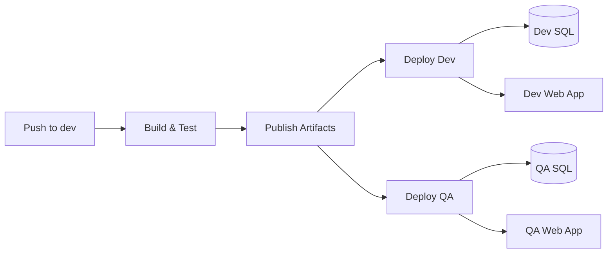

# CI/CD Setup Guide — Azure DevOps

This solution uses **Azure DevOps Pipelines** with **Environments** and **Variable Groups** for Dev, QA, and Production deployments.

## Pipeline files

| File | Trigger | Purpose |
|------|---------|---------|
| `azure-pipelines.yml` | Push/PR to **`dev`** | Build, test, artifacts; deploy to **Dev + QA** on push |
| `azure-pipelines-prod.yml` | Push to **`main`** / manual | Build, test, deploy to **Production** |
| `azure-pipelines-manual-deploy.yml` | **Manual only** | Deploy a **specific CI build** to Dev, QA, or Prod |

Reusable templates live in `pipelines/templates/`:

- `deploy-database.yml` — runs `Deploy-Database.ps1` via sqlcmd
- `deploy-api.yml` — configures App Service settings and deploys the API artifact

## Branch strategy

| Branch | Pipeline | Deploys to |
|--------|----------|------------|
| `dev` | `azure-pipelines.yml` | **Dev** + **QA** (parallel, on push only) |
| `dev` (PR) | `azure-pipelines.yml` | Build + test only (no deploy) |
| `main` | `azure-pipelines-prod.yml` | **Production** |

## Pipeline flow (push to `dev`)



Each deployment job runs **database scripts first**, then deploys the **API artifact**.

---

## Fail-fast behavior

Pipelines are configured to **stop immediately** when a step or stage fails:

| Setting | Effect |
|---------|--------|
| `condition: succeeded()` on steps | Skips remaining steps in the same job after a failure |
| Dev then QA stage order | QA deploy runs only after Dev succeeds (or Dev is skipped) |
| `dependsOn` + `succeeded('Build')` | Downstream stages do not run if an upstream stage fails |

**Exception:** SQL firewall cleanup still runs after a failed DB deploy so temporary firewall rules are removed.

---

## Azure DevOps setup

### 1. Create the project and connect the repo

1. In Azure DevOps, create a project (or use an existing one).
2. Go to **Repos** → import or push this repository.
3. Go to **Project Settings** → **Service connections** → **New connection** → **Azure Resource Manager**.
4. Name it **`StudentManagement-Azure`** (or update `azureServiceConnection` in the YAML files).

### 2. Create Environments

Go to **Pipelines** → **Environments** → **Create environment**:

| Environment | Purpose | Recommended |
|-------------|---------|-------------|
| `dev` | Development server | No approval |
| `qa` | QA server | Optional approval |
| `prod` | Production server | **Required approvers** |

For `prod`: open the environment → **Approvals and checks** → **Approvals** → add reviewers.

### 3. Create Variable Groups

Go to **Pipelines** → **Library** → **+ Variable group**.

Create three groups and link each to its environment (**Variable group** → **Link secrets from Azure Key Vault** optional):

#### `StudentManagement-Dev`

| Variable | Secret? | Example |
|----------|---------|---------|
| `sqlServer` | No | `cruddev.database.windows.net` |
| `sqlDatabase` | No | `StudentDb_Dev` |
| `sqlUsername` | No | `sqladmin` |
| `sqlPassword` | **Yes** | *(password)* |
| `sqlResourceGroup` | No | Azure resource group containing the SQL server (e.g. `rg-student-dev`) |
| `apiConnectionString` | **Yes** | `Server=tcp:...;Database=StudentDb_Dev;User ID=...;Password=...;Encrypt=True;` |
| `azureWebAppName` | No | `student-api-dev` |

#### `StudentManagement-QA`

Same variables with QA-specific values (`StudentDb_QA`, `student-api-qa`, etc.).

#### `StudentManagement-Prod`

Same variables with production values.

Link variable groups to pipelines in the YAML (already configured):

```yaml
variables:
  - group: StudentManagement-Dev
```

Authorize variable groups when prompted on first pipeline run.

### 4. Create pipelines

**Pipeline 1 — Dev & QA**

1. **Pipelines** → **New pipeline** → select your repo.
2. Choose **Existing Azure Pipelines YAML file**.
3. Select `/azure-pipelines.yml`.
4. Save and run.

**Pipeline 2 — Production**

1. **Pipelines** → **New pipeline** → same repo.
2. Select `/azure-pipelines-prod.yml`.
3. Save.

**Pipeline 3 — Manual Deploy (promote any build)**

1. **Pipelines** → **New pipeline** → same repo.
2. Select `/azure-pipelines-manual-deploy.yml`.
3. Rename to **Manual Deploy** (optional).
4. Edit `source:` in the YAML to match your CI pipeline name (e.g. `dotnetvinod.SampleWebAPI`).

### 5. SQL permissions

Grant the SQL login used in variable groups permission to create databases (first run) and deploy objects:

```sql
-- On master (Azure SQL): allow login to create databases if needed
-- For existing DB, on target database:
CREATE USER [sqladmin] WITH PASSWORD = '...';  -- if not exists
ALTER ROLE db_owner ADD MEMBER [sqladmin];
```

---

## Why Deploy Dev / QA was skipped

Deploy stages run only when **all** of these are true:

| Condition | Required |
|-----------|----------|
| Build succeeded | Yes |
| Not a Pull Request | Yes |
| Push to **`dev`** branch OR manual run with **Deploy to Dev/QA** checked | Yes |

**Most common cause:** pipeline was **Run manually** from **`main`** or **`Feature`** — not from a push to **`dev`**.

**Fix — automatic deploy:**

```powershell
git checkout dev
git push origin dev
```

**Fix — manual deploy from same pipeline:** **Run pipeline** → pick branch → check **Deploy to Dev** / **Deploy to QA** → Run.

**Fix — deploy a specific past build:** use **Manual Deploy** pipeline (below).

To see the exact reason: open the run → click skipped stage → read **"Stage not run because of condition"**.

---

## SQL firewall — one-time setup (Dev / QA)

Automated firewall in the pipeline is **OFF by default** (`enableAutomatedSqlFirewall: false`).

Microsoft-hosted agents use **changing IP addresses**. Your service connection also needs **Reader + SQL Server Contributor** to automate firewall rules — until that is configured, use this **one-time Portal setup**:

### Step 1 — Open SQL Server firewall (Dev)

1. [Azure Portal](https://portal.azure.com) → **SQL Server `cruddev`**
2. **Networking** (or **Firewalls and virtual networks**)
3. Under **Firewall rules**, click **+ Add a firewall rule**:
   - Rule name: `AllowPipelineAgentsDev`
   - Start IP: `0.0.0.0`
   - End IP: `255.255.255.255`
4. Enable **Allow Azure services and resources to access this server**
5. **Save**

> **Dev only:** `0.0.0.0`–`255.255.255.255` allows any IP. For production, use specific IPs or private endpoints instead.

Repeat on QA/Prod SQL servers when you deploy to those environments.

### Step 2 — Variable group (required)

**Pipelines → Library → StudentManagement-Dev** must include:

| Variable | Secret? | Example |
|----------|---------|---------|
| `sqlServer` | No | `cruddev.database.windows.net` |
| `sqlDatabase` | No | `StudentDb_Dev` |
| `sqlUsername` | No | your SQL login |
| `sqlPassword` | Yes | your SQL password |
| `apiConnectionString` | Yes | full connection string |
| `azureWebAppName` | No | your dev web app name |

`sqlResourceGroup` is only needed if you enable automated firewall (below).

### Step 3 — Push and run pipeline

After Portal firewall is saved, push to `dev` — **Deploy database scripts** should connect without the optional firewall step.

---

## Optional — enable automated firewall later

When your Azure admin grants the service connection:

1. **Reader** on subscription (to look up SQL server resource group)
2. **SQL Server Contributor** on server `cruddev`

Then set in **azure-pipelines.yml** or pipeline variables:

```yaml
enableAutomatedSqlFirewall: 'true'
```

And add `sqlResourceGroup` to each variable group (from SQL server **Overview → Resource group**).

Service principal object id (from your logs): `d9d290aa-7632-4181-9275-9e434e3a9d29`

```bash
az role assignment create \
  --assignee "d9d290aa-7632-4181-9275-9e434e3a9d29" \
  --role "SQL Server Contributor" \
  --scope "/subscriptions/511a3bfd-7085-457c-9f93-96c48e0681f2/resourceGroups/YOUR_RG/providers/Microsoft.Sql/servers/cruddev"
```

---

## SQL firewall error (Agent IP not allowed)

If deploy still fails with:

```
Client with IP address 'x.x.x.x' is not allowed to access the server
```

The Portal firewall rule was not saved, or you are deploying to a **different SQL server** than the one you configured. Confirm `sqlServer` in the variable group matches the server where you added the rule.

---

## Manual deploy — specific build to any environment

Use **`azure-pipelines-manual-deploy.yml`** to deploy an existing build without rebuilding.

1. **Pipelines** → **Manual Deploy** → **Run pipeline**
2. **Resources** → `ciBuild` → select the build run (e.g. `#20260614.2`)
3. **Target environment** → `dev`, `qa`, or `prod`
4. **Run database scripts** → checked = run SQL scripts first
5. **Run**

---

## Database automation

Scripts in `StudentManagement.Database/` run in order via `deploy/deploy-manifest.json`:

1. `001_CreateDatabase.sql` — creates DB on `master` if missing
2. `002_CreateTable.sql` — creates `Students` table
3. `003_StoredProcedures.sql` — creates/alters stored procedures

The pipeline installs `sqlcmd` on Linux agents and runs `Deploy-Database.ps1`.

### Manual local deploy

```powershell
cd StudentManagement.Database
./deploy/Deploy-Database.ps1 `
  -Server "yourserver.database.windows.net" `
  -Database "StudentDb_Dev" `
  -Username "sqladmin" `
  -Password "YourPassword"
```

---

## API configuration per environment

| Environment | `ASPNETCORE_ENVIRONMENT` | Config file |
|-------------|--------------------------|-------------|
| Dev | `Development` | `appsettings.Development.json` |
| QA | `QA` | `appsettings.QA.json` |
| Prod | `Production` | `appsettings.Production.json` |

Connection strings are set on Azure App Service during deployment via `ConnectionStrings__DefaultConnection` — never commit secrets to source control.

---

## Artifacts

On push to `dev`, the pipeline publishes:

| Artifact | Contents |
|----------|----------|
| `api` | Published .NET 8 Web API |
| `database` | SQL scripts + deploy tooling |

Production pipeline publishes the `api` artifact only (database scripts come from repo checkout during deploy).

---

## Customization

### Change service connection name

Edit `azureServiceConnection` in both pipeline YAML files, or override as a pipeline variable in Azure DevOps UI.

### Windows agents / IIS

Replace `deploy-api.yml` with a PowerShell step that copies files to IIS on a self-hosted agent, or use the **IIS web app deploy** task.

### Use Key Vault

Link secrets in variable groups to Azure Key Vault for centralized secret management.

---

## First-time checklist

- [ ] Azure DevOps project created and repo connected
- [ ] Azure Resource Manager service connection (`StudentManagement-Azure`)
- [ ] Environments: `dev`, `qa`, `prod` (with prod approvals)
- [ ] Variable groups: `StudentManagement-Dev`, `StudentManagement-QA`, `StudentManagement-Prod`
- [ ] Two pipelines created from `azure-pipelines.yml` and `azure-pipelines-prod.yml`
- [ ] Azure SQL servers and Web Apps provisioned per environment
- [ ] Push `dev` branch to trigger Dev + QA deployment
- [ ] Merge to `main` for production release
